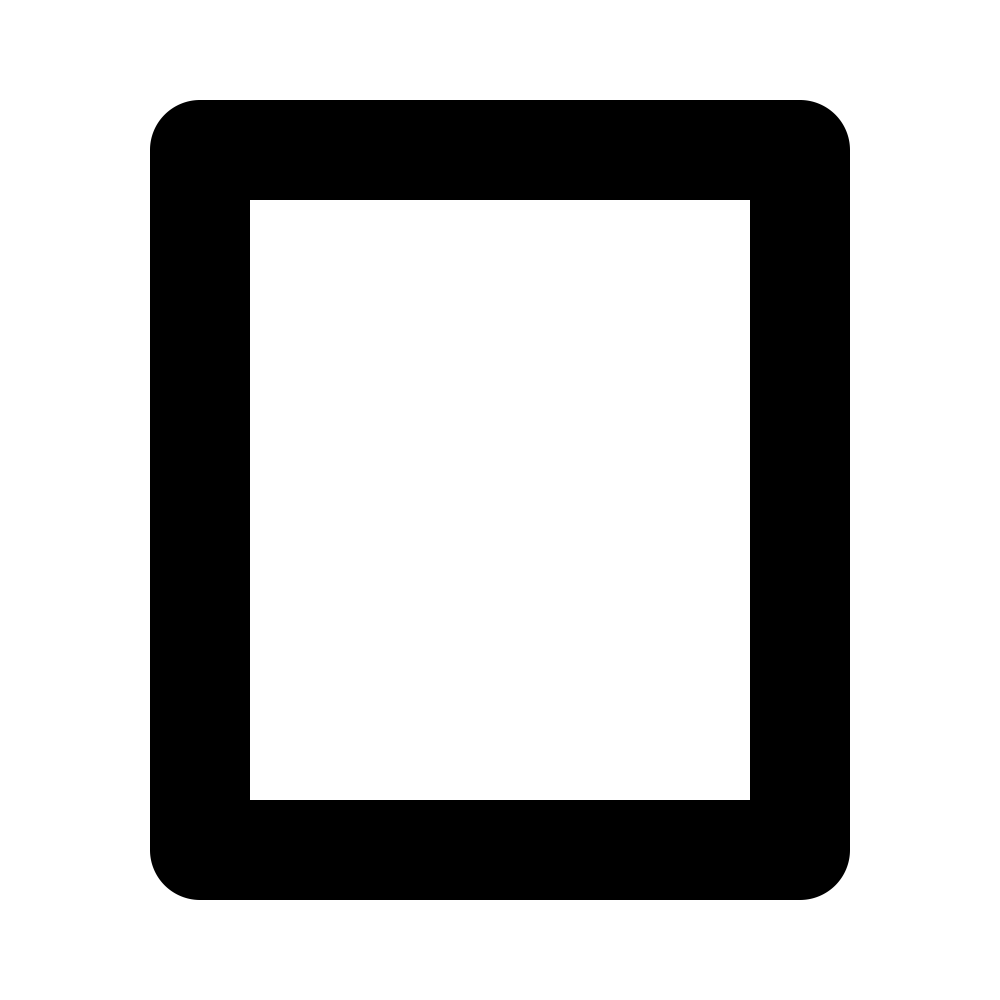
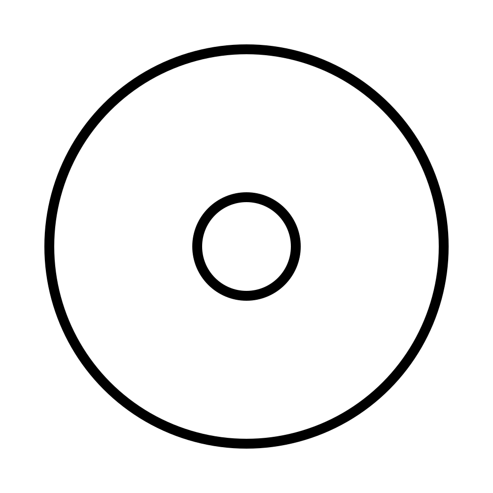

Trying my hand at making icons by coding directly in [SVG](https://www.w3.org/TR/SVG2/). Advantages:

- [Vector graphics](https://en.wikipedia.org/wiki/Vector_graphics), so scales well, no messy pixels mashing or stretching.
- Concise, no extra stuff thrown in by graphics tools. So far these are all less than 1k!
- Easy to read and tweak (edited and indented in Visual Studio Code with an [SVG extension](https://github.com/lishu/vscode-svg2)).
- A way to learn SVG (and avoid learning more graphics editing tools).

## Icon Design Guidelines

- [Apple Human Interface Guidelines](https://developer.apple.com/design/human-interface-guidelines/foundations/app-icons)
- [Material Icons Guide](https://developers.google.com/fonts/docs/material_icons)

## Graphic Designers

- [Susan Kare](http://kare.com/)
- [Paul Rand](https://www.paulrand.design/)
- [John Maeda](http://lawsofsimplicity.com/)

## Preview

